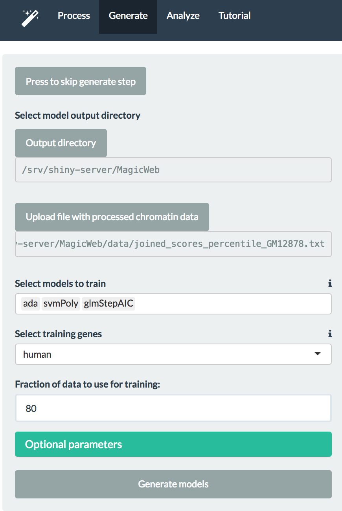
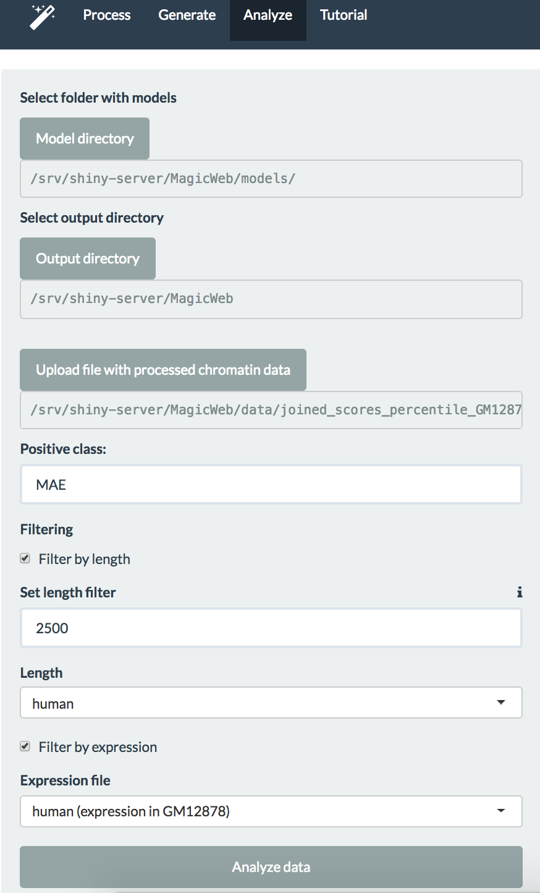

## Tutorial 

This tutorial will walk you through the steps of using the Shiny app.

### Step 1. ChIP-seq data processing

The first step is to process your ChIP-seq data from bigWig format to table format ready for use by generate.R and analyze.R. To do this, you need to specify a path to the folder containing your data and the input.txt file that includes the ChIP-seq files names (see [documentation](https://github.com/gimelbrantlab/magic/blob/master/documentation.md) for input.txt file format). For your convenience, we included testing data in the data folder, so you can run this example. You also need to specify an output folder and parameters for processing. Please specify the assembly, and if you want to include promoters into analysis, please specify their length. You can also choose filters to remove certain groups of genes from the analysis. 

In most cases, you want to filter out genes with input (control) values below certain threshold because these genes can give a very noisy signal. To do this, you can select the threshold for input values.

#### Output

The output consists of several parts. File joined_scored_percentile.txt will be saved in your output folder and will be used for further analysis. Images displayed in these tabs are used for quality control and to understand how your data looks.

*Processed data table* tab is the table representation of the file joined_scored_percentile.txt. You can look up genes of interest here and also sort your data to make sure you don't have any unusual values like Inf (hopefully, you don't!). 

*ChIP QC* tab provides insight into your ChIP-seq data. If you are going to classify genes into monoallelic and biallelic, it is expected that ChIP-seq values' distributions are bimodal or at least close to bimodal. Otherwise, you won't be able to get a meaningful classification. When you make a scatterplot for one chromatin mark versus another you also expect to have two lobes representing two groups of genes. If you don't, you may want to reconsider whether the data is appropriate for this analysis.

*Input distribution* tab contains the plot with the distribution of values in your input file. Also, it is a good QC check and you can use it to decide about the lowest threshold for your input.

### Step 2. Model generation

The second step is to train a model. If you don't want to generate a new model, you can skip this step and use one of our models at the next step. 

To train models, please specify the path to joined_scores_percentile.txt generated at the previous step (or, if you just want to run a test case, select joined_scores_percentile_full_dataset.txt from the data folder). You should also specify classes of models you want to train (we recommend starting with a generalized linear model (glm) and SVM). Additionally, you must specify what dataset should be used for training: genes classified as MAE or BAE with RNA-seq in clonal cell lines (select between our human or mouse datasets, or specify your own). For additional parameters, please see [documentation](https://github.com/gimelbrantlab/magic/blob/master/documentation.md).

#### Output

Trained models are tested with 20% of the data (this percent can be changed) and the models' performance is summarized here. In case of an imbalanced dataset (and in most cases you will have a much lower number of MAE genes), a precision-recall plot is used instead of a ROC curve.

### Step 3. Classification

The last step is to make predictions. Use joined_scores_percentile.txt file to make predictions with models in the folder that you specify. If you want to use our models, don't change the folder; if you want to use your own models, specify the folder with the models.

#### Output

The output predictions are saved in analysis_output folder for you. This tab gives you a table representation and allows to easily search for genes of interest.

